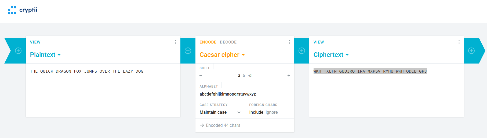
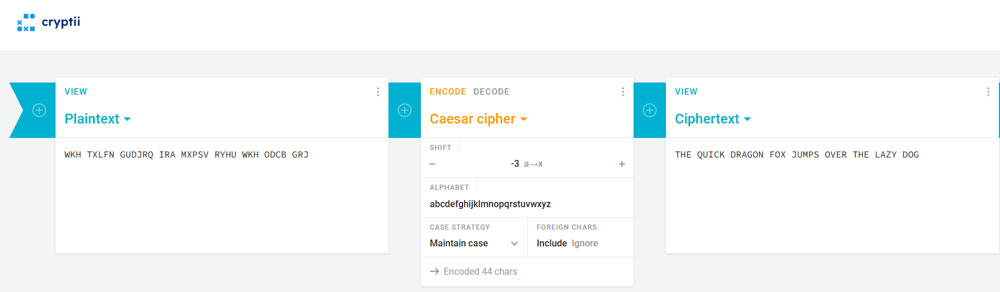
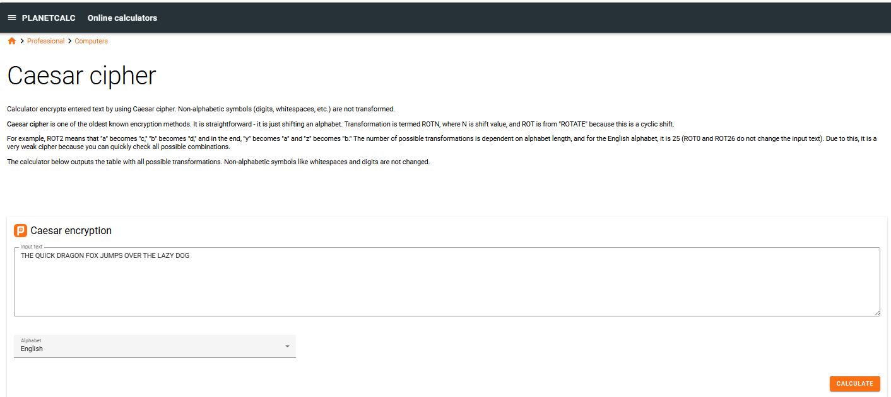
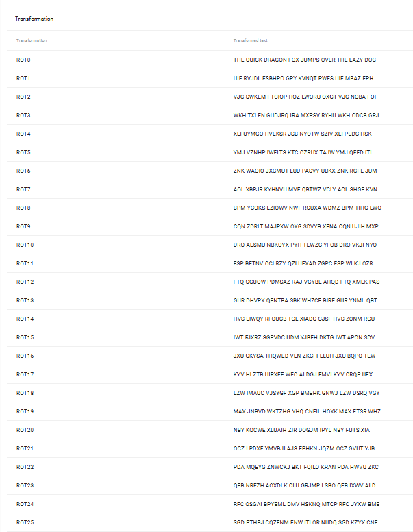
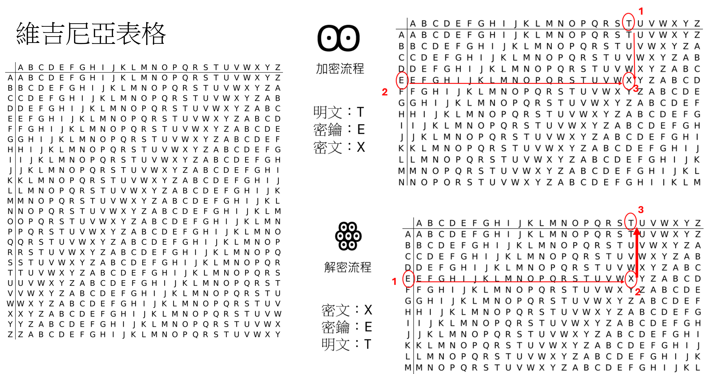

# 密碼學
- 加密前的原始資訊稱為明文（Plaintext）
- 加密後的資訊稱為密文（Ciphertext）
- 把明文轉換為密文的過程稱為加密（Encrypt）
- 把密文恢復成明文的過程稱為解密（Decrypt）。
# 古典密碼
- 凱撒密碼(Caesar Cipher)
- 維吉尼亞密碼(Vigenère cipher)
- [CTF實戰](CTF_Crypto1.md)

## [凱撒密碼](https://zh.wikipedia.org/wiki/%E5%87%B1%E6%92%92%E5%AF%86%E7%A2%BC)([Caesar Cipher](https://en.wikipedia.org/wiki/Caesar_cipher))
- 加密 ==> 偏移量是左移3(+3)
- 解密 ==> 偏移量是右移3(-3)
- 破密 == > 暴力攻擊 brute-force Attack ==> 把所有偏移量的結果都列出
- 特殊形凱撒密碼(Caesar Cipher)
  - 偏移量為10：Avocat(A→K)
  - 偏移量為13：[ROT13](https://en.wikipedia.org/wiki/ROT13)
  - 偏移量為-5：Cassis (K 6)
  - 偏移量為-6：Cassette (K 7)

### 加密 ==> 偏移量是左移3(+3)
```
明文字母表：ABCDEFGHIJKLMNOPQRSTUVWXYZ
密文字母表：DEFGHIJKLMNOPQRSTUVWXYZABC
```
- 明文：THE QUICK DRAGON FOX JUMPS OVER THE LAZY DOG
- 密文：....................
  
### 解密 ==> 偏移量是右移3(-3)

```
密文字母表：DEFGHIJKLMNOPQRSTUVWXYZABC
明文字母表：ABCDEFGHIJKLMNOPQRSTUVWXYZ
```

### ONLINE SOLVER:加密
- https://cryptii.com/pipes/caesar-cipher

### ONLINE SOLVER:解密

### 破密 == > 暴力攻擊 brute-force Attack ==> 把所有偏移量的結果都列出
- https://planetcalc.com/1434/





### [使用PYTHON|JAVA|c#程式解題](https://www.geeksforgeeks.org/caesar-cipher-in-cryptography/)

- https://planetcalc.com/1434/
- http://md5decrypt.net/en/Caesar/
- https://www.xarg.org/tools/caesar-cipher/

## [維吉尼亞密碼(Vigenère cipher)](https://zh.wikipedia.org/zh-tw/%E7%BB%B4%E5%90%89%E5%B0%BC%E4%BA%9A%E5%AF%86%E7%A0%81)
- 說明:
  - 使用一系列凱撒密碼組成密碼字母表的加密算法
  - 多表密碼的一種簡單形式 
- 加密
  - 明文為：ATTACKATDAWN
  - 關鍵字: LEMON ==> 密鑰(key): LEMONLEMONLE
  - 加密 == > 查表
```
明文：ATTACKATDAWN
密鑰：LEMONLEMONLE
密文：LXFOPVEFRNHR
```
- 解密== > 查表
```
密鑰：LEMONLEMONLE
密文：LXFOPVEFRNHR
明文：ATTACKATDAWN
```
- 恩師舉例說明

- 報告作業
```
```
明文：C
密鑰：N
密文：P
```
```
- 破密 == >多表密碼的破譯都是以字母頻率為基礎的頻率分析
